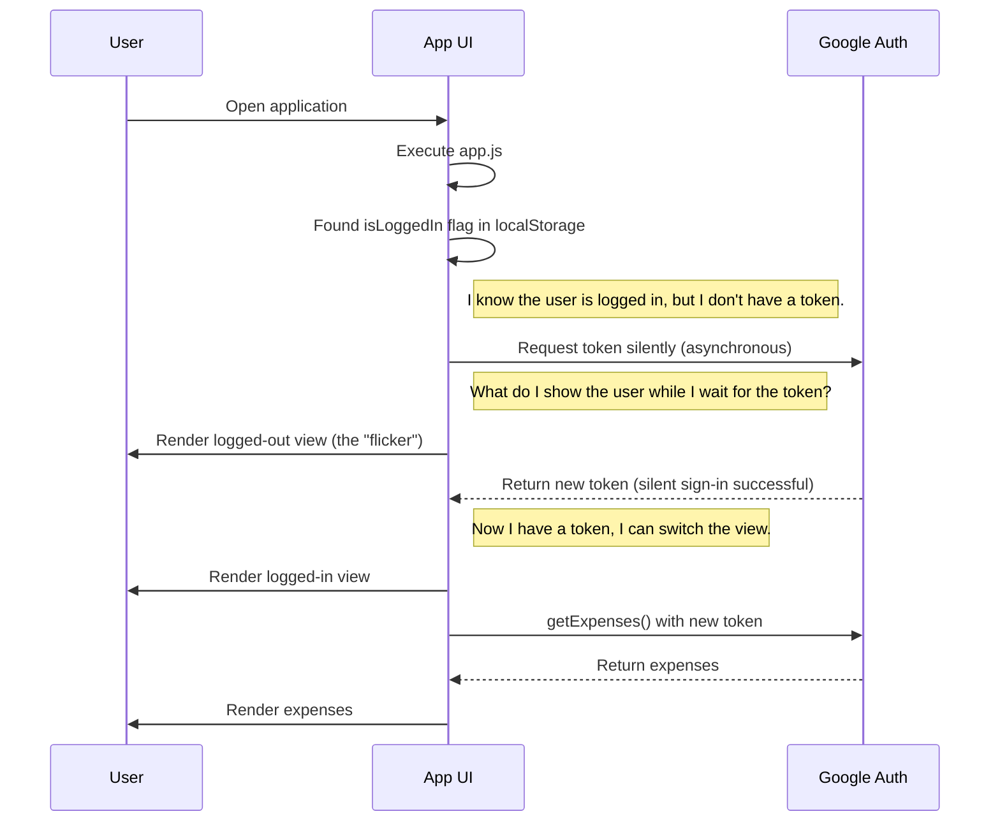

# The "Flicker" Effect Explained

This document explains the user experience trade-off between storing only the authentication state versus storing the access token with its expiration time.

## The Race Condition

When we store only the authentication state (e.g., `isLoggedIn: true`), the application knows that the user has previously signed in, but it does not have an access token to make API calls. It must request a new token from Google silently in the background.

This creates a race condition: the application needs to render the UI immediately, but it has to wait for the asynchronous silent sign-in to complete to know if it can show the logged-in view with data.

## Sequence Diagram

This diagram illustrates the scenario that can cause a "flicker" of the logged-out view.

## How Storing the Token Helps

By storing the access token with its expiration time, we can avoid this flicker effect most of the time.

-   When the application loads, it checks for the token in `localStorage`.
-   If a **valid, unexpired** token is found, the application can immediately render the logged-in view and start fetching data, without having to wait for a silent sign-in.
-   This results in a faster and smoother user experience.

The silent sign-in is still a good practice to get a fresh token, but having the stored token as a fallback for recent sessions makes the application feel more responsive.