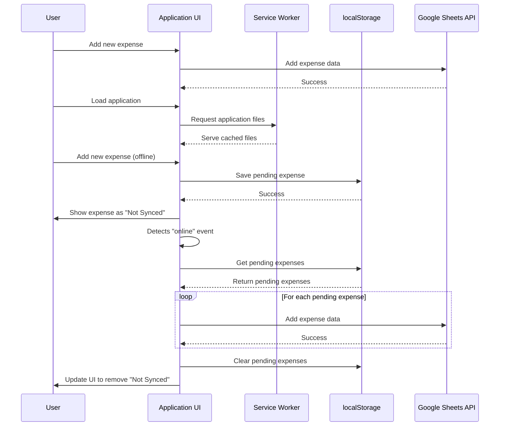
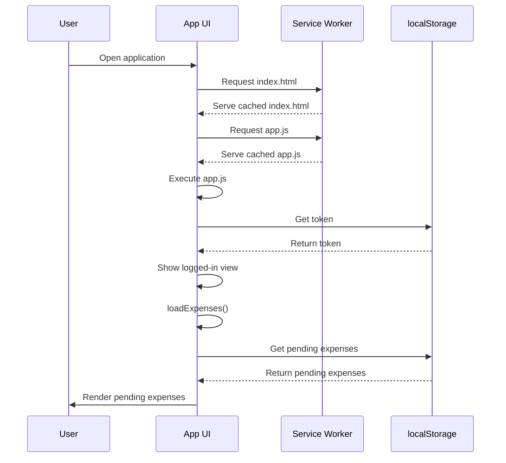
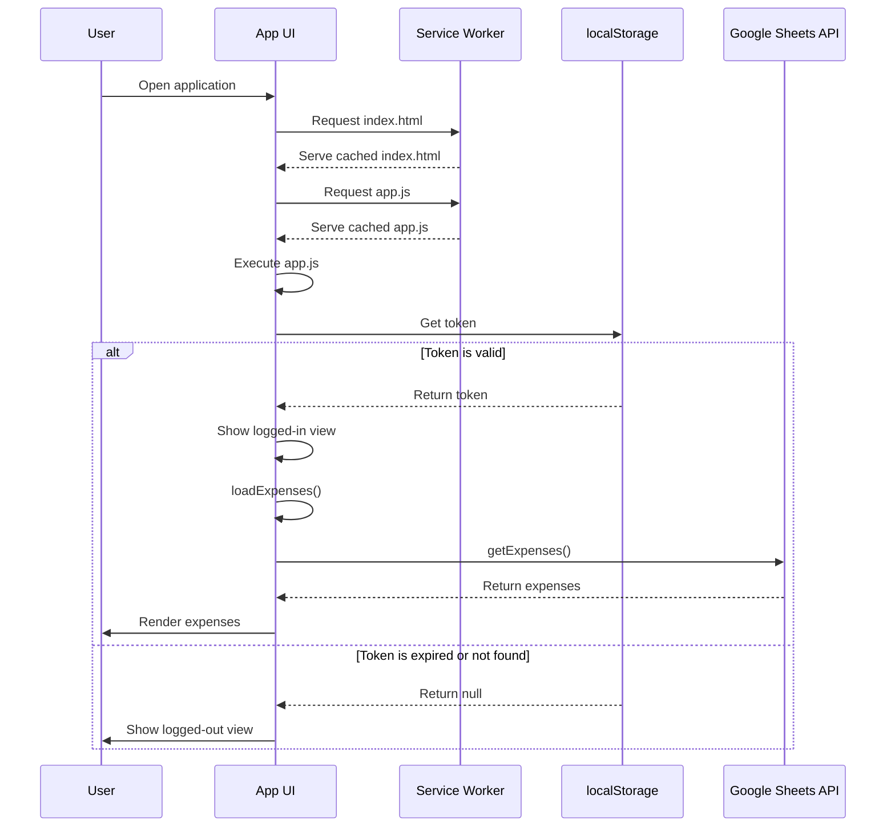

# Offline Flow Design

This document describes the design of the offline capabilities for the Expense Tracker application.

## 1. Overview

The primary goal of the offline flow is to allow users to continue using the application even when they do not have an internet connection. This includes loading the application, viewing previous data, and adding new expenses. New expenses added while offline are stored locally and synchronized with the Google Sheets API when the connection is restored.

## 2. Service Worker

A service worker is a script that the browser runs in the background, separate from the web page, enabling features like offline caching and background syncs.

-   **Caching:** The service worker caches the core application assets (the "app shell"), including `index.html`, all JavaScript files, and any CSS files. When the user loads the application, the service worker intercepts the network requests and serves the cached files, allowing the app to load even when offline.
-   **Updating:** The service worker is configured to automatically update to the latest version when the application is reloaded. When a new service worker is installed, it activates on the next page load and deletes the old caches.

## 3. Authentication State

To maintain the user's sign-in state across page reloads, the application stores the OAuth 2.0 access token in `localStorage`. 

-   **Token with Expiration:** The token is stored with its expiration time.
-   **State Check:** When the application loads, it checks for the token in `localStorage`. If a valid, unexpired token is found, the user is treated as signed in. If the token is expired or not found, the user is treated as signed out.

## 4. Offline Data Storage

-   **`localStorage`:** When the user adds a new expense while offline, the data is stored in the browser's `localStorage`. `localStorage` is a simple key-value store that persists across browser sessions.
-   **Pending Queue:** A dedicated `localStorage` key (e.g., `pending-expenses`) is used to store an array of expense objects that have not yet been synced with the Google Sheets API.

## 5. Synchronization

-   **Online Event:** The application listens for the browser's `online` event, which is fired when the network connection is restored.
-   **Sync Process:** When the `online` event is detected, the application:
    1.  Retrieves the pending expenses from `localStorage`.
    2.  Iterates through the pending expenses and sends them to the Google Sheets API.
    3.  Once all pending expenses have been successfully synced, the `pending-expenses` queue in `localStorage` is cleared.

## 5. Sequence Diagram

This diagram illustrates the interaction between the different parts of the system in various offline and online scenarios.

## 7. App Initialization Flow

These diagrams illustrate the application initialization flow in both offline and online scenarios.

### 6.1. Offline Initialization

### 6.2. Online Initialization

